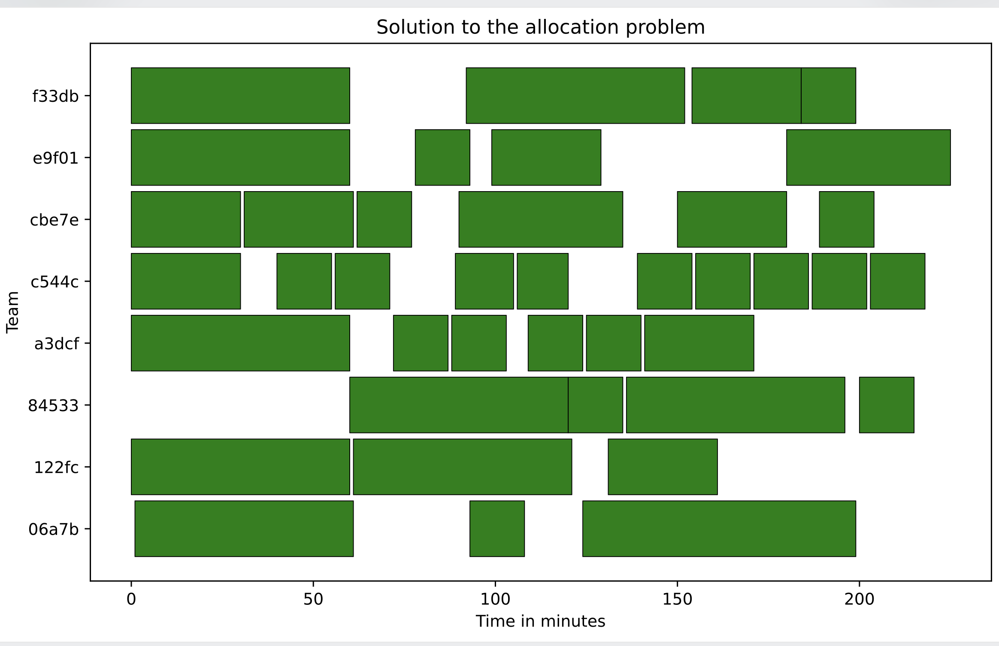
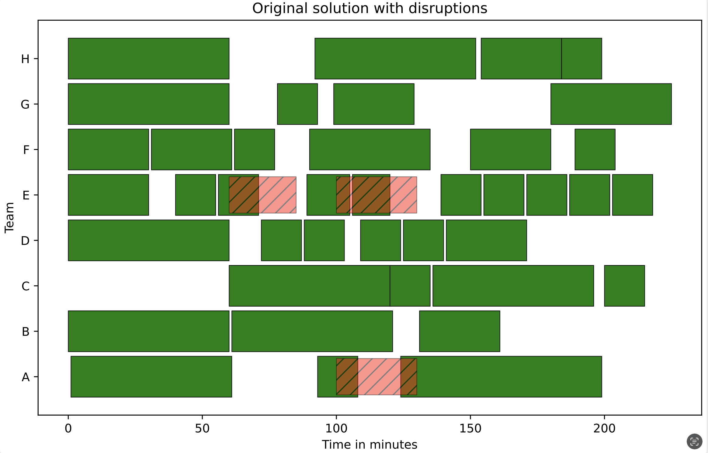
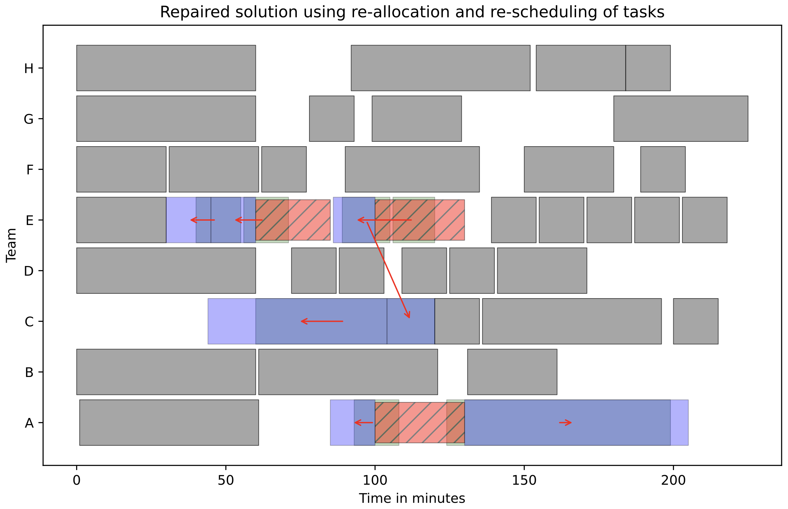

# Explainable Workforce Allocation and Scheduling

In collaboration with:

<div style="display: flex; align-items: center; gap: 10px;">
  
  
  
</div>


This repository contains the code and data for reproducing the results in our paper:

## Modeling and Solving
We consider the problem of scheduling and allocation of logistical tasks to worker teams in the aircraft manufacturing industry.
In this problem, we are given a set of tasks and worker teams, where each team can execute a subset of the tasks based on their training.
The goal is to allocate all tasks in such a way that a minimum number of teams is required, and such that the workload is _fair_ among the worker teams.
That is, all worker teams should work at approximately the same time during the shift.

`models.py` contains the code for generating the CPMpy models to solve this problem. You can use any solver in the CPMpy modeling system to solve them, but we recommend using `gurobi` to solve the allocation problem, and `ortools` or `cp-optimizer` to solve the scheduling problem.

The resulting schedule looks as follows:


## Explaining
During the working day, the schedule may be disrupted due to unforeseen circumstances.
For example, adverse weather conditions, technical malfunctions, or injured team members may cause a team to become temporarily unavailable throughout the day.
In response, the pre-computed allocation should be revised such that all tasks can still be executed.
For example, by rescheduling and reallocating the tasks to teams that are not disrupted.

Below, we show how we can repair the schedule after disruptions have occurred.

<div style="display: flex; align-items: center; gap: 10px;">
  
  
</div>


## Structure of the repository
```
├── data
│   ├── anon_jsons              # data used in the paper (8h horizon)
│   ├── anon_jsons_24hours      # larger instances (24h horizon)
│   └── anon_scenarios          # disruption scenarios used in the paper
├── example_explain.ipynb       # example script for explaining after disruption
├── example_solve.ipynb         # example of solving the problem
├── explain.py                  # code for the feasibility restoration model
├── generator.py                # code for generating disruptions
├── models.py                   # CPMpy models for allocation/scheduling problem
└── utils.py
```

## Citation

If you use the models or data from this repository, please consider citing:
```bibtex
@inproceedings{bleukx2025allocation,
  author       = {Ignace Bleukx and
                  Ryma Bouzazouma and
                  Tias Guns and
                  Nadine Laage and
                  Guillaume Poveda},
  title        = {Modeling and Explaining an Industrial Workforce Allocation and Scheduling Problem},
  booktitle    = {{CP}},
  series       = {LIPIcs},
  volume       = {282},
  publisher    = {Schloss Dagstuhl - Leibniz-Zentrum f{\"{u}}r Informatik},
  year         = {2025}
}
```
